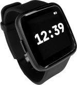
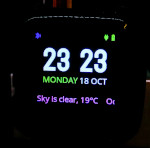

<pre>
ooo        ooooo oooooo   oooo         ooooooooooooo  o8o                              
`88.       .888'  `888.   .8'          8'   888   `8  `"'                              
 888b     d'888    `888. .8'                888      oooo  ooo. .oo.  .oo.    .ooooo.  
 8 Y88. .P  888     `888.8'                 888      `888  `888P"Y88bP"Y88b  d88' `88b 
 8  `888'   888      `888'     8888888      888       888   888   888   888  888ooo888 
 8    Y     888       888                   888       888   888   888   888  888    .o 
o8o        o888o     o888o                 o888o     o888o o888o o888o o888o `Y8bod8P' 
                                                                                        
</pre>

# PineTime smartwatch

The **Pinetime** smartwatch is built around the NRF52832 MCU (512KB Flash, 64KB RAM), a 240*240 LCD display driven by the ST7789 controller, an accelerometer, a heart rate sensor, and a vibration motor.

> The PineTime is a free and open source smartwatch capable of running custom-built open operating systems. Some of the notable features include a heart rate monitor, a week-long battery, and a capacitive touch IPS display that is legible in direct sunlight. It is a fully community driven side-project which anyone can contribute to, allowing you to keep control of your device.

*https://www.pine64.org/pinetime/*

*https://wiki.pine64.org/index.php/PineTime*

MY-Time 
========================================

The purpose of **MY-Time** is to build a firmware for Pinetime that is lightweight:

 - Code written in **C++**;
 - Build system based on **CMake and Ninja**;
 - Using **[FreeRTOS 10.0.0](https://freertos.org)** real-time OS;
 - Arduino Core for **[Adafruit Bluefruit nRF52 Boards](https://github.com/adafruit/Adafruit_nRF52_Arduino)**
 - UI library **[LVGL 8](https://lvgl.io/)**;
 - Bluetooth Nordic Softdevice **[S112 nrf52 6.1.1 softdevice](https://www.nordicsemi.com/Products/Development-software/nRF5-SDK)**;

Build and flash MY-Time 
========================================
 - https://www.nordicsemi.com/Products/Development-tools/nRF-Util
 - https://developer.arm.com/-/media/Files/downloads/gnu-rm/10.3-2021.10/gcc-arm-none-eabi-10.3-2021.10-x86_64-linux.tar.bz2
 - python
   - pip install intelhex

<pre>

$ sudo apt install build-essential
$ wget https://developer.arm.com/-/media/Files/downloads/gnu-rm/10.3-2021.10/gcc-arm-none-eabi-10.3-2021.10-x86_64-linux.tar.bz2
$ sudo tar xjf gcc-arm-none-eabi-10.3-2021.10-x86_64-linux.tar.bz2 -C /usr/share
$ sudo apt install ninja-build
$ sudo apt install cmake

$ git clone --recurse-submodules https://github.com/joaquimorg/MY-Time.git
$ cd MY-Time
$ mkdir build
$ cmake -S . -B "build" -G "Ninja" -DCMAKE_BUILD_TYPE=Release -DARM_NONE_EABI_TOOLCHAIN_PATH=/usr/share/gcc-arm-none-eabi-10.3-2021.10

$ cmake --build build

$ cmake --build build --target FLASH

WSL Windows build fix
$ sudo nano/etc/wsl.conf
[automount]
options = "metadata"

</pre>

Docs
========================================

Web Bluetooth Secure DFU : https://thegecko.github.io/web-bluetooth-dfu/examples/web.html

Nordic's Secure DFU bootloader, a step by step guide

https://devzone.nordicsemi.com/nordic/short-range-guides/b/software-development-kit/posts/getting-started-with-nordics-secure-dfu-bootloader

